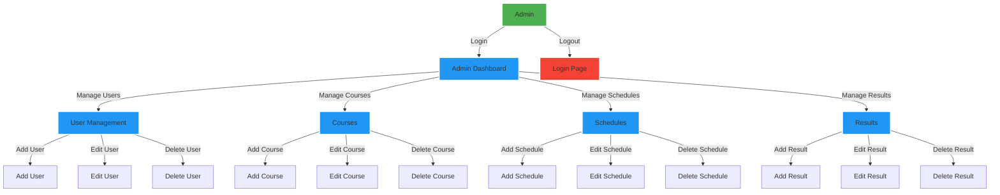
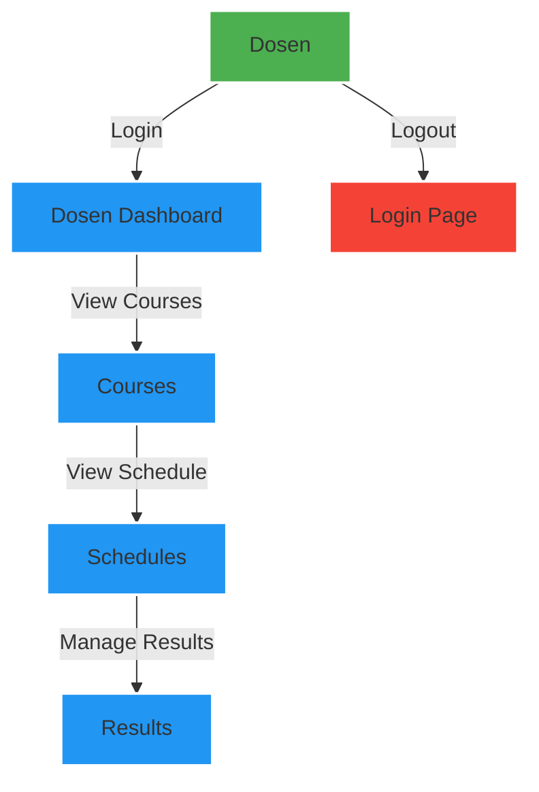
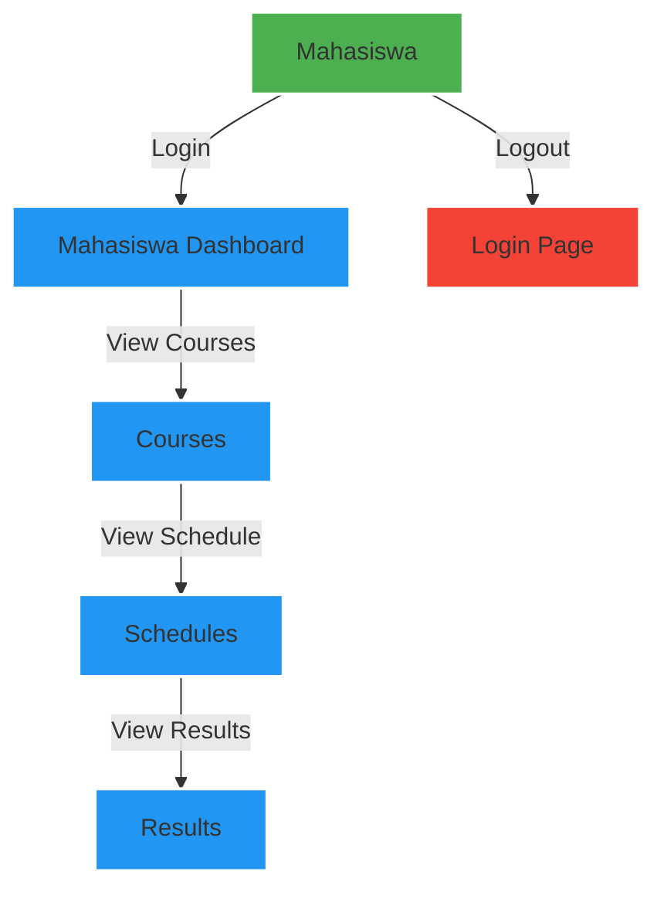

# User Requirements

## Overview

Aplikasi ini dirancang untuk menganalisis pengelolaan akademik di lingkungan universitas. Pengguna utama aplikasi ini adalah administrator, profesor, dan mahasiswa. Berikut adalah kebutuhan utama dari masing-masing pengguna.

## Administrator

Administrator bertanggung jawab untuk mengelola sistem secara keseluruhan.

- **Login dan Keamanan:**

  - Administrator harus dapat login dengan akun khusus.
  - Sistem harus menyediakan mekanisme keamanan yang kuat, termasuk manajemen hak akses.

- **Manajemen Dosen:**

  - Menambahkan, menghapus, dan mengubah informasi dosen.
  - Mengelola keahlian dan tugas dosen.

- **Manajemen Mahasiswa:**

  - Menambahkan, menghapus, dan mengubah informasi mahasiswa.
  - Mengelola status mahasiswa dan informasi pribadi.

- **Manajemen Matakuliah:**

  - Menambahkan dan mengelola daftar matakuliah.
  - Mengatur prasyarat dan batasan kursi untuk setiap kelas.

- **Jadwal Kuliah:**
  - Membuat dan mengelola jadwal kuliah.
  - Memastikan tidak ada tumpang tindih dalam jadwal.

## Profesor

Profesor menggunakan aplikasi untuk manajemen kursus dan melacak hasil studi mahasiswa.

- **Login dan Keamanan:**

  - Profesor harus dapat login dengan akun khususnya.
  - Hak akses harus memungkinkan akses ke fungsi manajemen kursus dan hasil studi.

- **Manajemen Kursus:**

  - Menambahkan dan mengelola informasi kursus.
  - Mengatur materi, tugas, dan ujian.

- **Manajemen Hasil Studi:**
  - Menginput dan melihat hasil studi mahasiswa.
  - Memberikan umpan balik kepada mahasiswa.

## Mahasiswa

Mahasiswa menggunakan aplikasi untuk mengakses jadwal kuliah, hasil studi, dan merencanakan studi.

- **Login dan Keamanan:**

  - Mahasiswa harus dapat login dengan akun khususnya.
  - Hak akses harus memungkinkan akses ke informasi pribadi dan akademik.

- **Melihat Jadwal Kuliah:**

  - Melihat jadwal kuliah untuk setiap semester.
  - Melihat detail ruangan dan waktu.

- **Melihat Hasil Studi:**

  - Melihat hasil studi semester sebelumnya.
  - Melihat nilai dan catatan dosen.

- **Merencanakan Studi:**
  - Merencanakan kursus untuk semester berikutnya.
  - Memeriksa prasyarat kursus.

## Diagram Alur `Admin`

## Diagram Alur `Dosen`

## Diagram Alur `Mahasiswa`

